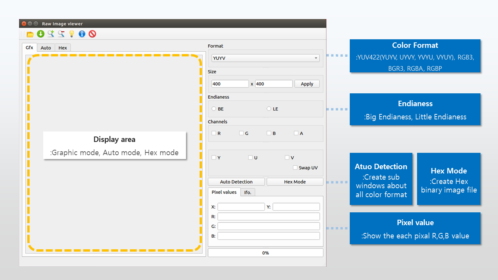
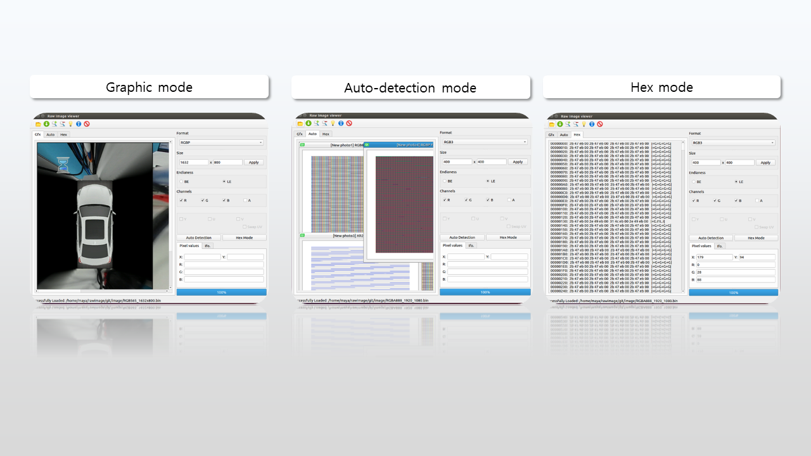

# Raw image viewer
**Raw image viewer** loads and parses raw images into selected color format(YUV422, RGB888, RGB565, RGBA) on QT UI.

Form implementation is generated by reading ui file 'MainGUI.ui' made by Qt designer.

The program based on **Python**, and uses OpenCV, Numpy, Pillow libraries (tested on 3.7.0).

## Features
> It displays the binary raw file in graphical mode and in Hex mode.
* Graphic mode: Generall image viewer mode
* Auto mode: Display raw files in all color formats
* Hex mode: Display raw files as Hex mode
> It can adjust image size, color format and check the value of each channel.
* Supported formats are YUV422(UYVY, YUYV, VYUY, YVYU), RGB888, RGB565, RGBA
> You can save the parsed file as compression image format(jpeg, png).

## Structure
* **Application structure**


* **Examples**



* **File Structure**
```ruby
rawimage/
├── icon              (Application ui icon)
│   ├── ...
├── outline           (Application outline screen shot)
│   ├── ...
├── image             (Sample raw image files)
│   ├── ...
├── __pycache__
│   ├── ...
├── MainGUI.ui        (Qt desinger ui)
├── MainGUI.py        (Coversion file from .ui to .py)
├── main.py           (Main function)
├── Parser.py         (Parsing to other color spaces)
└── LoadPicture.py    (Load sub windows for automaically showing all color spaces)
```

## Ingredients
* **Python 3.6 + (tested on 3.7.0)**
  * Using PyQt5 libraries that is a Python binding to the cross-platform GUI toolkit Qt
  * Using Numpy, OpenCV, PIL, Enum libraries for processing the images
  * Using Time libraries to check Application performance
* **Qt designer**


## Prerequiste
* OS: Ubuntu and Windows (tested on Ubuntu 16.04)
* Python 3.6(+=)
* Python libraries (based on PyPI(Python Package Index))


## Getting Started 
**1) Installation (on Ubuntu 16.04)**
```ruby
$ sudo apt-get install python3
$ curl -k -O https://bootstrap.pypa.io/get-pip.py
$ python get-pip.py
$ pip install times pytest-timeit Pillow enum PyQt5 opencv-python numpy

**1) Installation (on Ubuntu 16.04)**
```ruby
$ sudo apt-get install python3
$ curl -k -O https://bootstrap.pypa.io/get-pip.py
$ python get-pip.py
$ pip install times pytest-timeit Pillow enum PyQt5 opencv-python numpy
```

**2) Usage Syntax**
```ruby
$ python main.py
```

**3) Key board support**
* Ctrl + O: Show the file dialog to select the raw image file
* Ctrl + O: Show the file dialog to save the raw image file
* Ctrl ++: Zoom in to +0.1
* Ctrl +-: Zoom out to -0.1
* Ctrl + i: Show the application information
* Ctrl + q: Quik the Application


**4) Default Feature**
* Color format: YUYV
* Width * Height: 400 * 400
* Console: print out time consumption


**4) Auto detection**
* Format Matching
  - If you set the format as YUV Format(YUYV, UYVY, VYUY, YVYU), it will be shown all YUV format)
* Channel Matching
  - If you choice only Y channel, It will be shown all YUV format with only Y channel


## Limitation
* Hex Viewer is Slow
* Some exceptions might not be handled.
* Can't load big endian image in auto detection mode
